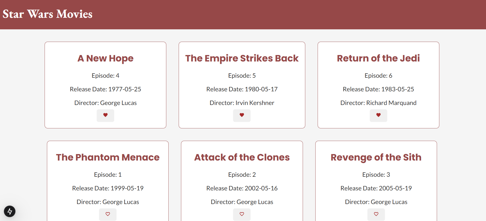

# Star Wars Favorites

This project is a web client application for browsing Star Wars movies and marking your favorites, built with Next.js.

## Features

- Fetches data from the Star Wars API (SWAPI)
- Allows marking/unmarking movies as favorites
- Stores favorite selections in the browser using localStorage
- Responsive design

## How to Run Locally

1. Clone the repository:

   ```bash
   git clone https://github.com/onico100/star-wars-favorites
   cd star-wars-favorites
   ```

2. Install dependencies:

   ```bash
   npm install
   ```

3. Run the development server:
   ```bash
   npm run dev
   ```
   The application will be available at http://localhost:3000.

# App Screenshots

Home page:



Movie details card:


